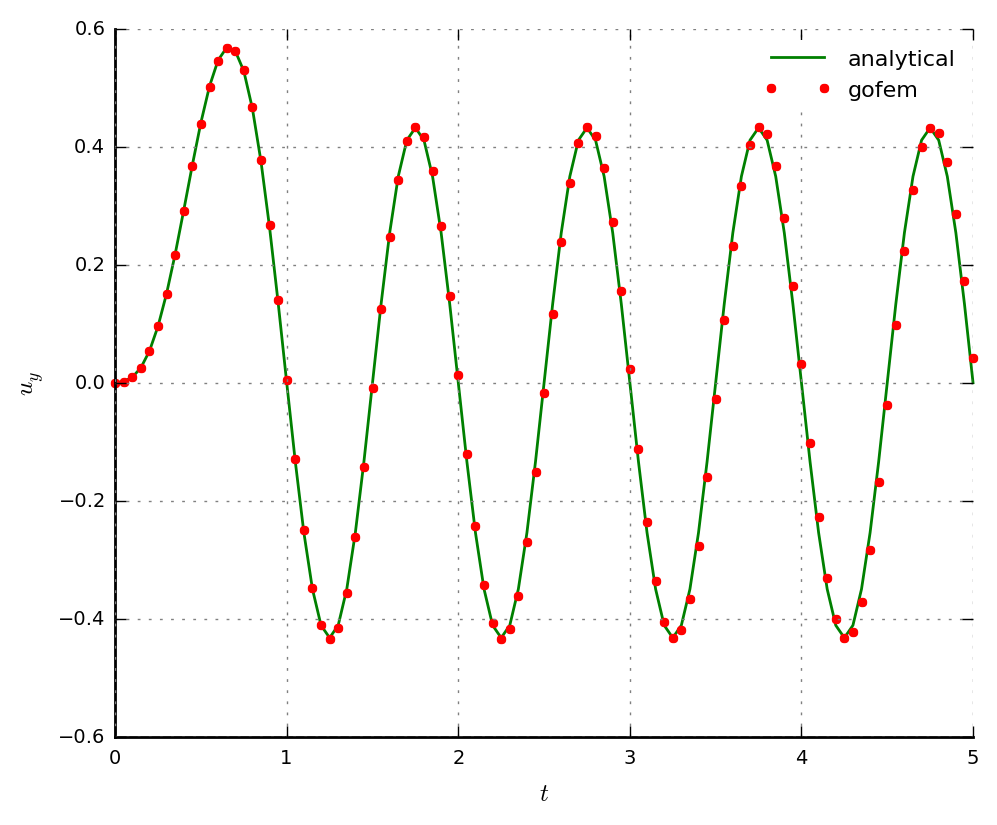
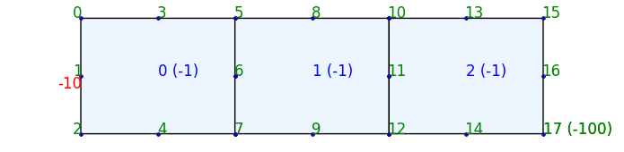
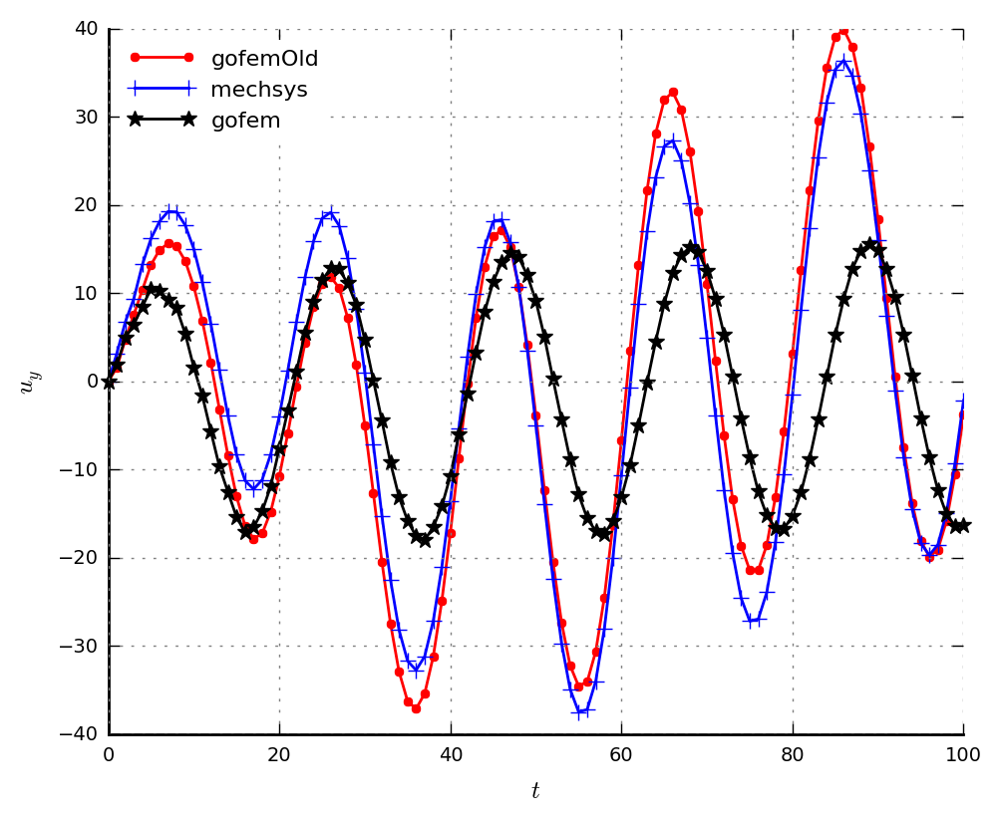
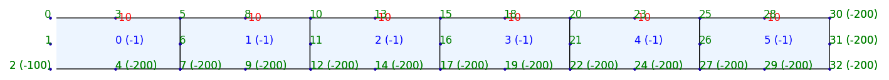
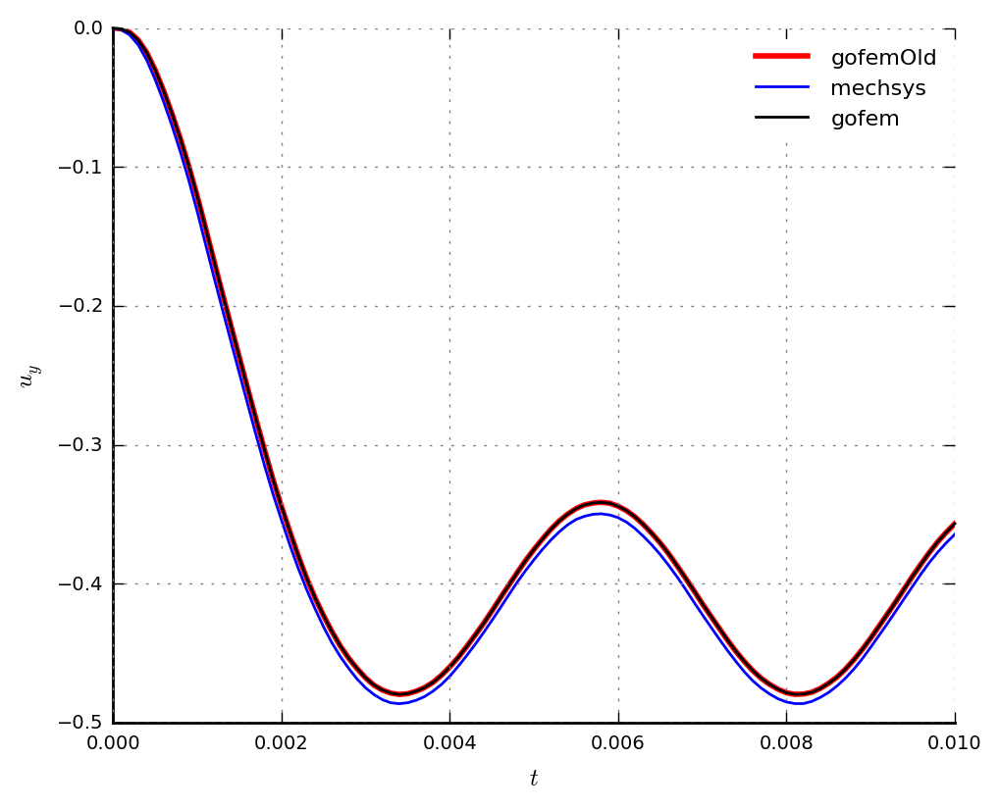
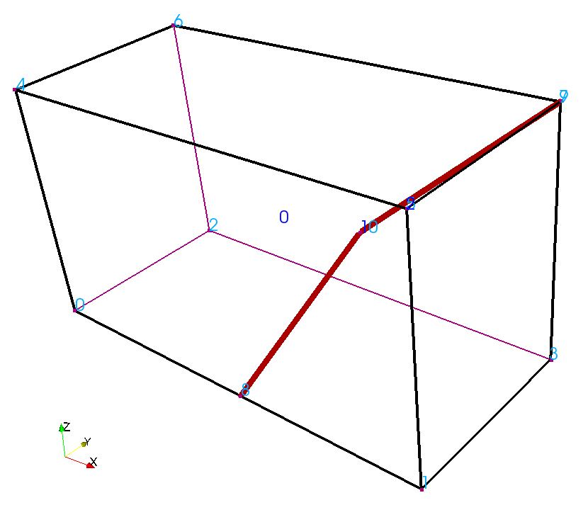
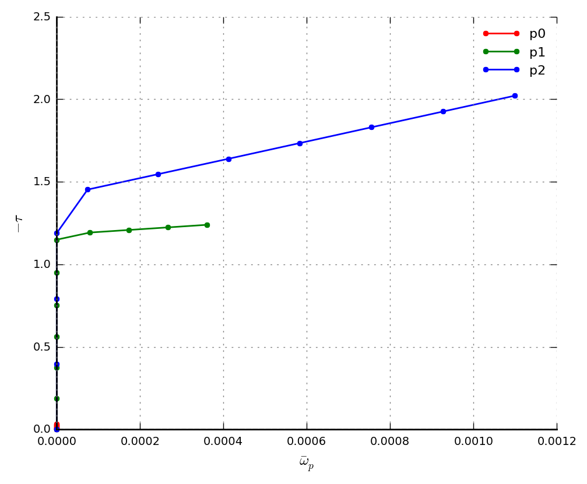
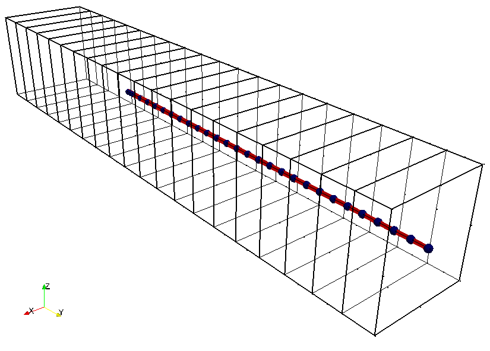
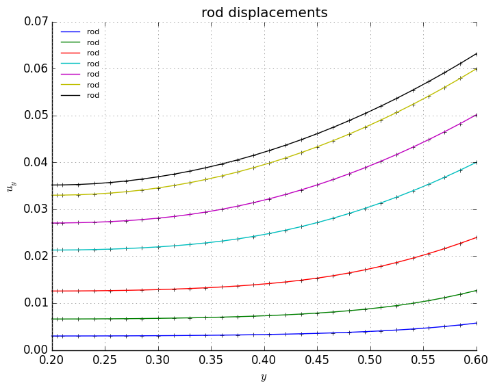

# Gofem --- examples

## Summary
1.  **dynamics_sgbook** -- Solid dynamics. Examples from Smith, Griffiths and Margetts book [1].
2.  **rjoint_ex01_curved** -- Rod-Joint model for reinforced concrete [2,3].
3.  **rjoint_ex06_pullout** -- Pullout test in reinforced concrete [2,3].
4.  **seep_ex01_freesurf** -- Transient simulation with seepage face. Rectangle domain. [4]
5.  **seep_ex02_freesurf** -- Transient simulation with seepage face. Earthen Slope. [4]
6.  **seep_simple_flux** -- Simple flux in a horizontal permeametre. 2D and 3D simulations with computation of water discharge.
7.  **spo751_pressurised_cylinder** -- Internally pressurised cylinder. Plasticity problem number 7.5.1 (page 244) from Souza-Peric-Owen (SPO) book [5].
8.  **spo754_strip_footing_collapse** -- Strip-footing collapse. Plasticity problem number 7.5.4 (page 252) from Souza-Peric-Owen (SPO) book [5].
9.  **up_3mcolumn_desiccation** -- Desiccation of porous column. Unsaturated porous media simulation from [6].
10. **up_indentation2d_unsat** -- Indentation of unsaturated porous medium. Similar to example in [6].

## References
1. Smith, Griffiths and Margetts (2013) Programming the Finite Element Method. 5th Edition. Wiley. ISBN: 978-1-119-97334-8. 682 pages.
2. Durand, Farias and Pedroso (2015) A rod-joint finite element for reinforced solids without the need for mesh compatibility.
3. Durand, Farias and Pedroso (2015) Computing intersections between non-compatible curves and finite elements. Computational Mechanics. [doi:10.1007/s00466-015-1181-y](http://dx.doi.org/10.1007/s00466-015-1181-y).
4. Pedroso (2015) A solution to transient seepage in unsaturated porous media. Computer Methods in Applied Mechanics and Engineering. 285:791-816. [doi:10.1016/j.cma.2014.12.009](http://dx.doi.org/10.1016/j.cma.2014.12.009).
5. de Souza Neto, E. A., Peric, D., and Owen, D. R. J. (2008) Computational Methods for Plasticity: Theory and Applications. Wiley. 791 pages. [doi:10.1002/9780470694626](http://dx.doi.org/10.1002/9780470694626).
6. Pedroso (2015) A consistent u-p formulation for porous media with hysteresis. International Journal for Numerical Methods in Engineering. 101:606-634. [doi:10.1002/nme.4808](http://dx.doi.org/10.1002/nme.4808).

# 1 dynamics_sgbook -- Solid dynamics

## 1.1 Forced vibrations. Single beam element with dynamic load

See page 487 of [1].

### 1.1.1 Geometry, mesh and boundary conditions

Finite element mesh.

### 1.1.2 Results

Deflection at the right hand side.

## 1.2 Forced vibrations. Solid element with dynamic load

See page 491 of [1].

### 1.2.1 Geometry, mesh and boundary conditions

Finite element mesh.

### 1.2.2 Results

Deflection.

## 1.3 Plastic slab with impacting distributed load

See page 515 of [1].

### 1.3.1 Geometry, mesh and boundary conditions

Finite element mesh.

### 1.3.2 Results

Deflection.

# 2 rjoint_ex01_curved -- Rod-Joint model for reinforced concrete

A curved rod is immersed in a parallelepiped and has a force applied to one of its end.

## 2.1 Mesh

Mesh with curved rod (3-node element shown by straight lines in red).

## 2.2 Results

Shear stress along joint element.

# 3 rjoint_ex06_pullout -- Pullout test in reinforced concrete

Pullout test in reinforced concrete block.

## 3.1 Mesh

Finite element mesh.

## 3.2 Results

Displacements of nodes along rod (rebar).

# 4 seep_ex01_freesurf -- Transient simulation with seepage face

# 5 seep_ex02_freesurf -- Transient simulation with seepage face
# 6 seep_simple_flux -- Simple flux in a horizontal permeametre
# 7 spo751_pressurised_cylinder -- Internally pressurised cylinder
# 8 spo754_strip_footing_collapse -- Strip-footing collapse
# 9 up_3mcolumn_desiccation -- Desiccation of porous column
# 10 up_indentation2d_unsat -- Indentation of unsaturated porous medium

## Pullout test: rjoing_ex06_pullout

3D beam with one steel rod being pulled out

The plot shows the displacement of rod nodes for a number of time outputs. 'y' is the length of the
rod starting from 0.20 because the rod is inside the beam.

## Horizontal permeameter: seep_simple_flux

Cylinder with porous media under seepage only. With gravity. To the left hand side hydrostatic
pressure is kept constant. To the right hand side, pressure is decrease by the following _shift_

_hst_ specifies a **shift** of liquid pressure according to:

$$
  pl(t,z) = pl_0(z) - shift(t)
$$

_hydrost_ must be true in _stages_

_dvgctrl_ divergence control will reduce the time step in case divergence occurs

The plot shows ...

## Plotting

Use package _out_

## Notes

Check gofem/inp/sim.go
Check where 2/3, 5/6, 8/9 came from? (Zienkiewicz)
